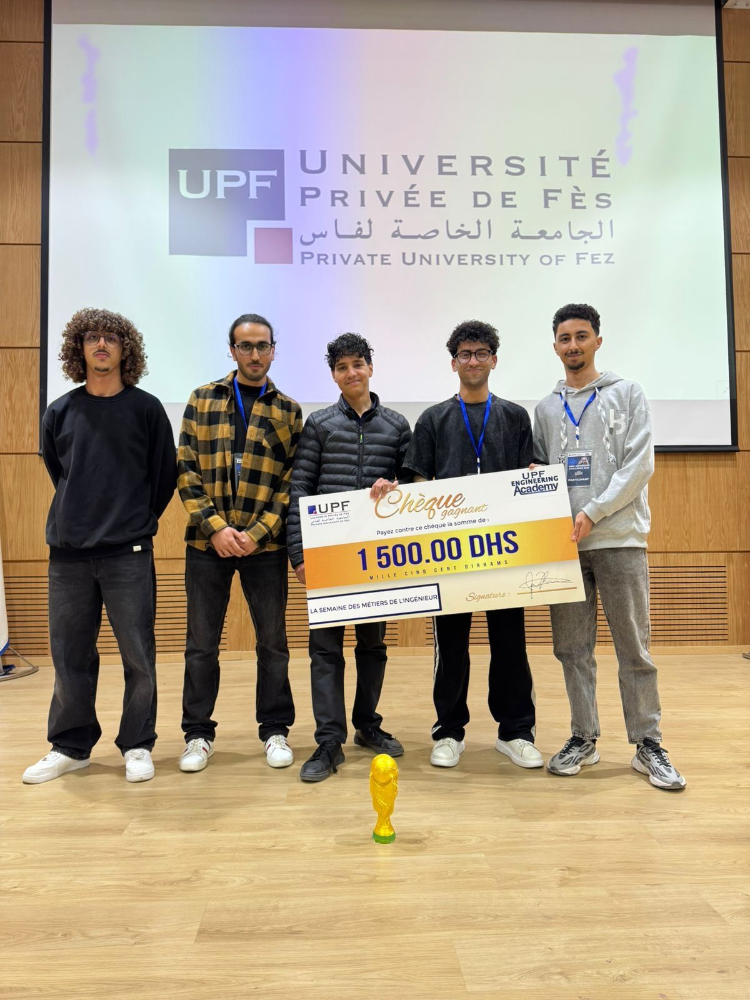
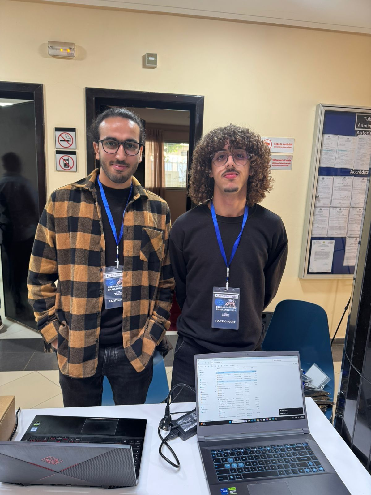

# 🏆 XR Football Experience – 1er Prix au XR Innovation Competition 🇲🇦⚽️

## 🎉 Résumé du projet

Nous sommes fiers de présenter **notre projet XR immersif dédié aux fans de football**, récompensé par la **1ère place au XR Innovation Competition**. À l’aube de la **CAN 2025** organisée au Maroc et de la **Coupe du Monde 2030** coorganisée, notre projet vise à réinventer l’expérience des supporters grâce aux technologies de **Réalité Étendue (XR)**.

---

## 🌍 Objectif du projet

> **Offrir aux fans une immersion totale dans l’ambiance des matchs, que ce soit depuis leur salon ou directement dans le stade.**

---

## 🖼️ Aperçus du projet

### Interface immersive pour les supporters

### Équipe projet lors du concours

---

## 🚀 Fonctionnalités clés

- 🕶️ **Immersion XR** : Plongez dans le match en 360°, en réalité virtuelle ou mixte.
- 🗣️ **Interactions personnalisées** : Supporters, chants, replays dynamiques, réactions en temps réel.
- 🏟️ **Reconstitution de stades** : Modélisation 3D fidèle des lieux emblématiques.
- 🎮 **Expériences interactives** : Mini-jeux, parcours immersifs, avatars supporters.

---

## 🏅 Distinction

> 🥇 **1er Prix au XR Innovation Competition 2025**  
> Cette récompense consacre notre innovation, notre passion et des mois de travail intense.

---

## 🤝 L’équipe derrière le projet

Un immense bravo à notre équipe exceptionnelle :

- 👨‍💻 **Abdelali Mardi**  
- 👨‍💻 **YOUNESS AOUAM**  
- 👨‍💻 **Ali BOUZIANE**  
- 👨‍💻 **Ahmed Didouh**  
- 👨‍💻 **Mohammed Amine FARAH**

Avec le soutien technique et humain précieux de **Mohamed Zaifri** 🙏

---

## 🎓 Remerciements

Merci à l’**Université Privée de Fès (UPF)** pour son appui constant, sa vision, et sa confiance dans ce projet innovant.

---

## 🎥 Teaser vidéo

🔗 Découvrez le teaser de notre expérience XR :  
[👉 Visionner sur LinkedIn](https://lnkd.in/eAracpDY)

---

## 📬 Contact

**Ali Bouziane**  
📧 bouziane_ali@upf.ac.ma  
🔗 [LinkedIn](https://www.linkedin.com/in/ali-bouziane/)
